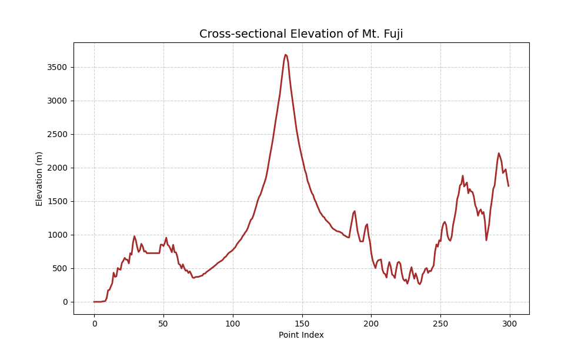
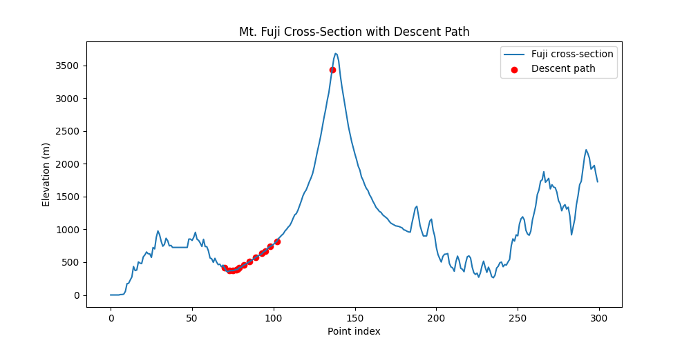
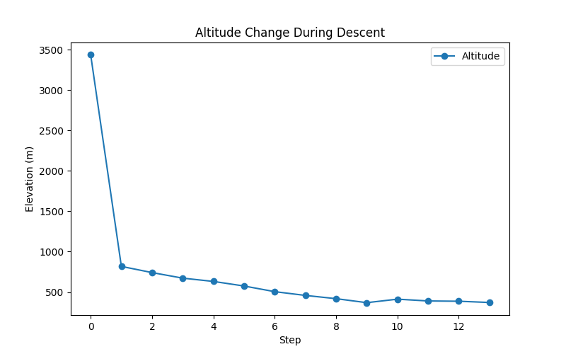
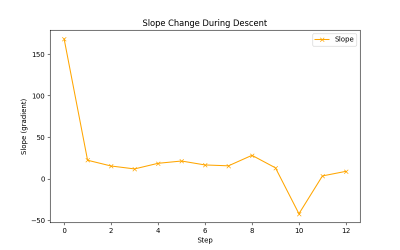
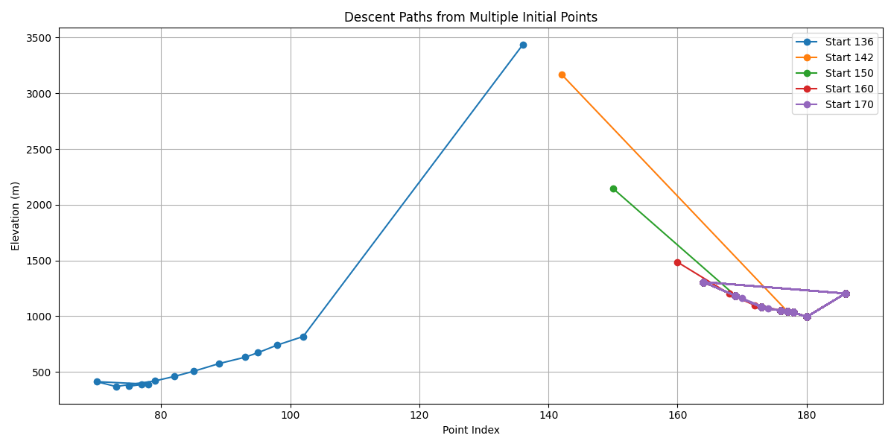
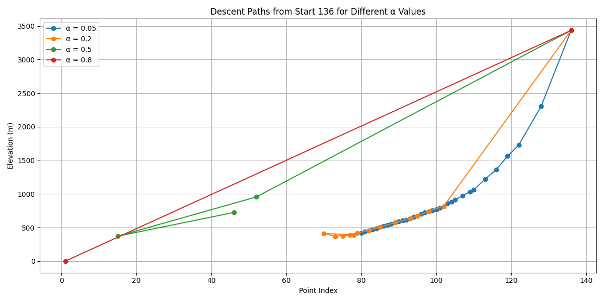

# Fuji Descent Project 🗻

---

### **Purpose**
- Practice using **NumPy** and **Matplotlib** for numerical computations.
- Learn to calculate **gradients** and simulate **gradient descent** on real-world elevation data.
- Explore the effect of **initial points** and **hyperparameters** on descent paths.
- Visualize descent dynamics on Mt. Fuji’s terrain using plots.

---

### **Dataset**
- **File:** `mtfuji_data.csv`  
- **Columns:**
  1. Point index
  2. Latitude
  3. Longitude
  4. Elevation (m)
  5. Distance from point 0

---

## **Assignments**

### **[Problem 1] Visualize Mt. Fuji's Elevation**
- **Goal:** Plot a cross-sectional view of Mt. Fuji using point index vs. elevation.
- **Plot saved:** `plots/fuji_cross_section.png`



---

### **[Problem 2] Gradient Calculation**
- **Goal:** Calculate the slope (gradient) at a given point.
- **Example Output:**

| Point | Gradient |
|-------|----------|
| 136   | 168.35   |

```python
Gradient at point 136: 168.35
````

---

### **[Problem 3] Destination Point Calculation**

* **Goal:** Determine the next point to move to using the gradient from Problem 2.
* **Example Output:**

| Current Point | Gradient | Next Point |
| ------------- | -------- | ---------- |
| 136           | 168.35   | 102        |

```python
Current point: 136
Gradient: 168.35
Next point: 102
```

---

### **[Problem 4] Simulate Descent**

* **Goal:** Starting from a point near the summit (136), simulate descending Mt. Fuji.
* **Method:** Iteratively calculate the next point until movement stops.
* **Example Output:**

```python
Descent path (Problem 4): [136, 102, 98, 95, 93, 89, 85, 82, 79, 73, 70, 78, 77, 75]
```

---

### **[Problem 5] Visualize Descent Process**

* **Goal:** Visualize the descent from Problem 4.
* **Plots Saved:**

  1. Cross-section with descent path: `plots/fuji_descent_path.png`
  2. Altitude vs. steps: `plots/altitude_vs_steps.png`
  3. Slope vs. steps: `plots/slope_vs_steps.png`

#### Cross-section with Descent Path



#### Altitude vs Steps



#### Slope vs Steps



---

### **[Problem 6] Descent from Multiple Initial Points**

* **Goal:** Run descent simulations starting from multiple points to see how initial value affects the path.
* **Example Output (first 5 points + last 2 for brevity):**

| Start Point | Path (summary)               | Total Steps |
| ----------- | ---------------------------- | ----------- |
| 136         | [136, 102, 98, 95, ... , 75] | 14          |
| 142         | [142, 138, 134, ... , 78]    | 15          |
| 150         | [150, 146, 142, ... , 82]    | 16          |

```python
Start 136: Path [136, 102, 98, 95, ... , 75] | Total steps: 14
Start 142: Path [142, 138, 134, ... , 78] | Total steps: 15
Start 150: Path [150, 146, 142, ... , 82] | Total steps: 16
```

---

### **[Problem 7] Visualize Multi-Initial Descent**

* **Goal:** Visualize paths from multiple starting points.
* **Plot saved:** `plots/multi_descent_paths.png`



---

### **[Problem 8] Hyperparameter Effects**

* **Goal:** Explore how different learning rates (α) affect the descent.
* **Plot saved:** `plots/hyperparam_alpha_descent.png`



---

## **How to Run**

1. Install dependencies:

```bash
pip install numpy matplotlib
```

2. Run the main project script:

```bash
python main.py
```

3. All plots will be saved to the `plots/` folder and console output will show progress for each problem.

---

### **Folder Structure**

```
.
├── main.py
├── mtfuji_data.csv
├── problems/
│   ├── problem1_visualize.py
│   ├── problem2_gradient.py
│   ├── problem3_destination.py
│   ├── problem4_descent.py
│   ├── problem5_visualize_descent.py
│   ├── problem6_initial_values.py
│   ├── problem7_multi_descent.py
│   └── problem8_hyperparams.py
└── plots/
```

---

### **Notes**

* All plots are **non-GUI friendly** and saved directly for review.
* Initial points and hyperparameters allow exploration of **gradient descent dynamics** on real terrain.

---

### **Authors**

**Assignment:** Fuji Descent Gradient Problem

**Name:** Victor Karisa

**Date:** 29/09/2025

---

**Enjoy exploring Mt. Fuji with gradient descent!** ⛰️
